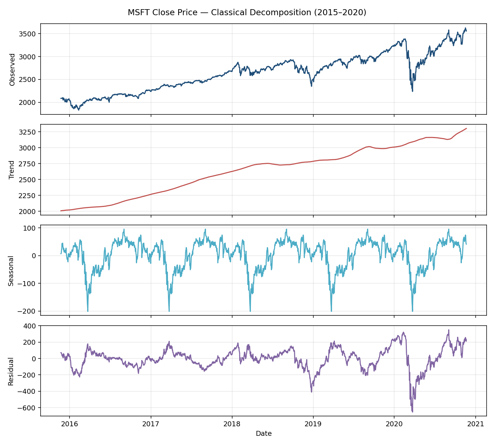
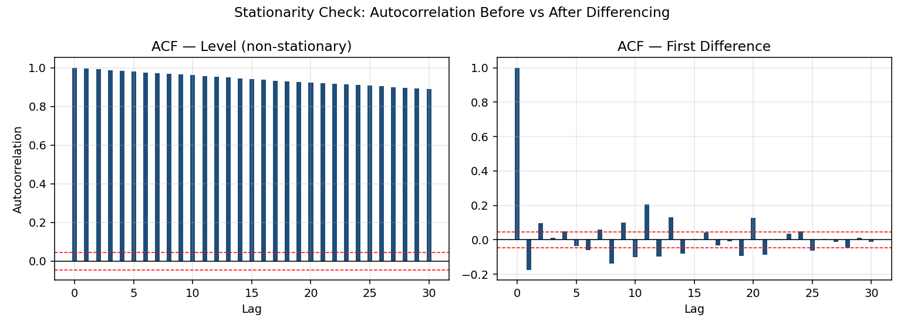
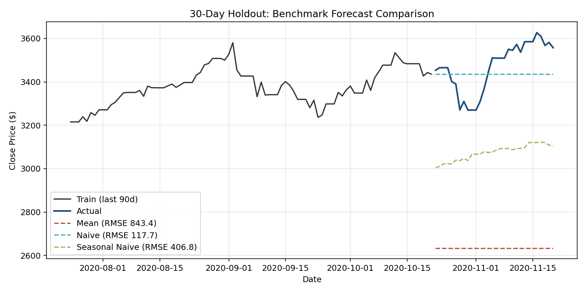

# Financial Time Series Forecasting — Microsoft Stock (2015–2020)

Decomposition, stationarity analysis, and forecast benchmarking on five years
of MSFT daily closing prices, including a comparison of daily vs. monthly
SARIMA models.

## Objective

Apply core time series techniques to a real financial dataset: decompose the
series into trend/seasonal/residual components, test and address
non-stationarity, benchmark simple forecasting methods, and fit SARIMA models
at two granularities to compare their fit.

## Dataset

- **Source:** [Microsoft Stock Time Series (Kaggle)](https://www.kaggle.com/datasets/vijayvvenkitesh/microsoft-stock-time-series-analysis)
- **Period:** 2015-11-23 to 2020-11-20 (1,825 daily observations)
- **Fields:** `Date`, `Open`, `High`, `Low`, `Close`, `Volume`, `Adj Close`

## Key Steps

1. **Decomposition** — classical additive decomposition and STL, both on the
   full series and on a pre-pandemic window (2015–2019) isolated after
   spotting a structural break at the March 2020 crash.
2. **Stationarity** — Augmented Dickey-Fuller test on the raw series, followed
   by first/second-order differencing, log-return transformation, scaling,
   and weekly seasonal differencing, each checked via ACF and a Ljung-Box test.
3. **Benchmark forecasting** — Mean, Naive, and Seasonal Naive forecasts
   compared on a holdout window.
4. **Price indices** — fixed-base and chained-base indices from the close
   price, plus Laspeyres/Paasche/Fisher indices (quantities simulated, since
   the dataset has no real quantity series).
5. **SARIMA modelling** — two `auto.arima` models: one on daily prices, one on
   monthly averages (12-period seasonality), compared on residual
   autocorrelation and residual variance.

## Tools & Libraries

R — `forecast`, `fpp2`, `tseries`, `xts`, `zoo`, `TTR`, `imputeTS`, `dplyr`,
`lubridate`, `ggplot2`, `ggfortify`

## Results

**Decomposition** — a clear upward trend with a sharp dip at the March 2020
structural break, and a mild annual seasonal component:



**Stationarity** — the level series shows the slow-decaying ACF typical of a
non-stationary process; first differencing removes most of the
autocorrelation, though not all of it:



**Benchmark forecasts** — on a 30-day holdout, Naive clearly outperforms Mean
and Seasonal Naive, consistent with the series behaving close to a random
walk:



**SARIMA — daily vs. monthly**

| Model | Residual autocorrelation | Residual variance |
|---|---|---|
| Model 1 — daily | 0.0003 | 5.14 |
| Model 2 — monthly (period = 12) | -0.1291 | 34.04 |

Model 1 (daily) fits better on both metrics. Model 2's 12-period seasonal
structure can still be the more practical choice when a monthly-resolution
forecast is what the use case actually calls for.

## Key Insights

- The series has a clear structural break at the COVID-19 crash (March 2020);
  decomposition and modelling are more reliable when this window is treated
  separately.
- Every stationarity treatment tried (differencing, log-returns, scaling,
  seasonal differencing) reduced but did not fully remove residual
  autocorrelation — a common outcome for daily financial data, not a
  data-preparation error.
- The Naive forecast — "tomorrow's price is today's price" — beat both Mean
  and Seasonal Naive on the holdout, which is the expected result for a
  near-random-walk price series with no strong weekly or monthly seasonal
  signal.
- Daily-resolution SARIMA fit the data better than monthly, but the right
  granularity ultimately depends on the forecast horizon a real use case
  needs.

## Limitations

- Full whiteness (no remaining autocorrelation) was not achieved despite
  trying five different stationarity transformations — flagged here rather
  than hidden, since it reflects a real property of the data.
- The Laspeyres/Paasche/Fisher index calculation uses simulated quantities;
  it demonstrates the method, not a real trade-volume analysis.
- `frequency = 365` on daily data is a simplification (ignores that trading
  years have ~252 sessions, not 365); a business-day calendar frequency would
  be a more rigorous choice for a production model.

## Repo Structure

```
.
├── data/yahoo_stock.csv              # raw dataset
├── scripts/time_series_analysis.R    # full analysis, cleaned and sectioned
├── output/                           # exported figures used in this README
└── README.md
```

## Reproducing

```r
setwd("path/to/repo")
source("scripts/time_series_analysis.R")
```

Requires R ≥ 4.0. The script installs any missing packages on first run.

*Note: the three figures above were regenerated in Python (pandas +
matplotlib) from the same dataset for this README, since the original R
session's plots weren't exported as image files. Running `time_series_analysis.R`
reproduces the same analysis natively in R.*
